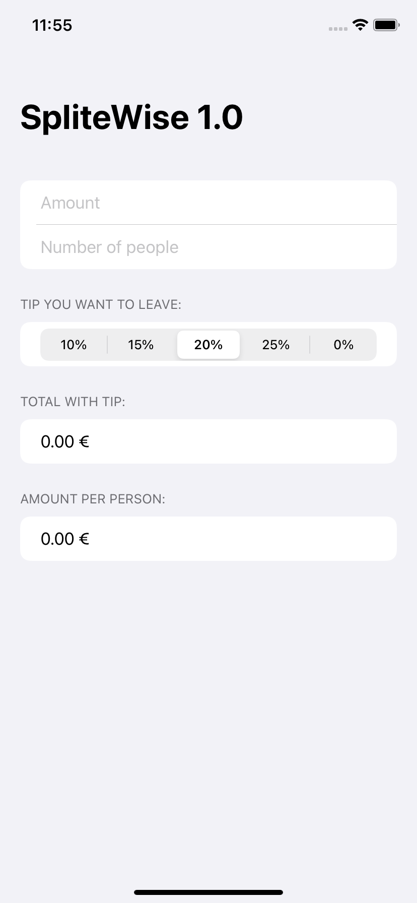
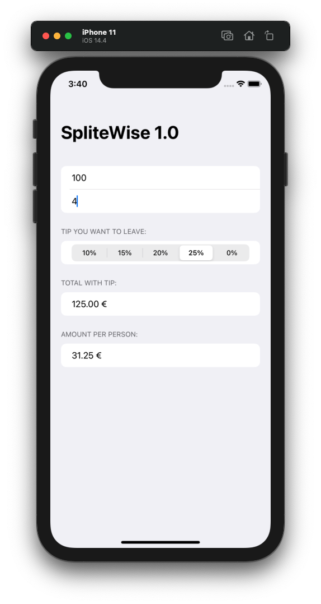

# Project 01 - WeSplit

Project #1 of "100 days of SwiftUI" course. 
Day 16: https://www.hackingwithswift.com/100/swiftui/16

## Challenge Solutions

> 1.Add a header to the third section, saying “Amount per person”

Added a new Section with the Header Text and showing the amount per person.

> 2.Add another section showing the total amount for the check – i.e., the original amount plus tip value, without dividing by the number of people.

Added a new Section with the header text, and displayed the total amount. The amount was by the commuted property totalWithTip. Doing a classic mathematic Rule of Three to get the amount of the tip later adding it to the total amount to get the result.

> 3.Change the “Number of people” picker to be a text field, making sure to use the correct keyboard type.

Changed the picker to text field, and adding the property .keyboardType(.decimalPad) to only let the user type numbers.

## Screenshoots

 
