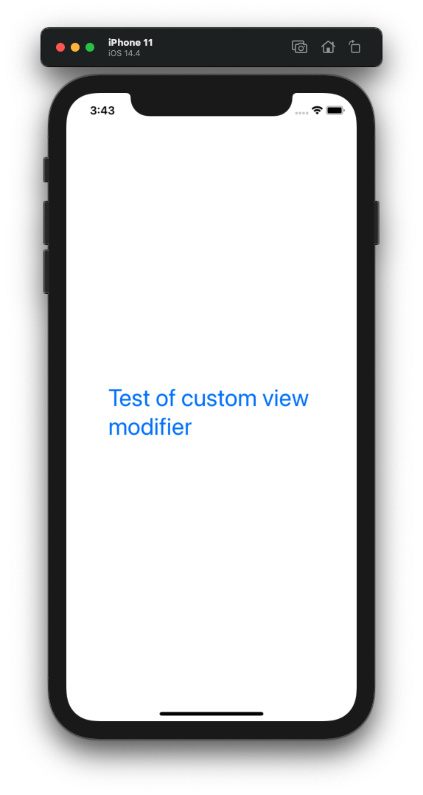

# Project 03 - ViewsAndModifiers

Project #3 of "100 days of SwiftUI" course. 
Day 23: https://www.hackingwithswift.com/100/swiftui/23

## Solution to challenges

>1. Create a custom ViewModifier (and accompanying View extension) that makes a view have a large, blue font suitable for prominent titles in a view.

Same code Paul uses in his explanation of view modifiers, just added the foreground color and deleted extra modifiers.

>2. Go back to project 1 and use a conditional modifier to change the total amount text view to red if the user selects a 0% tips.

I created a new variable to observe the value of the tipPercentaje, so if this is 0% the foreground color of the ammount will be red, otherwise black.

You can go to the [Project 1](01-splitThat)  and see the changes, there is a comment on each line that was changed because of this challenge.

>3. Go back to project 2 and create a FlagImage() view that renders one flag image using the specific set of modifiers we had.

In this case we take the Image view out of the body, created a structu called FlagImage() with a var variable name, where we passed the flag name, and then in the forEach only called FlagImage with the init, passing the name of the flag.

You can go to the [Project 2](03-guessTheFlag) and see the changes, there is a comment on each line that was changed because of this challenge.

## Screenshoots

