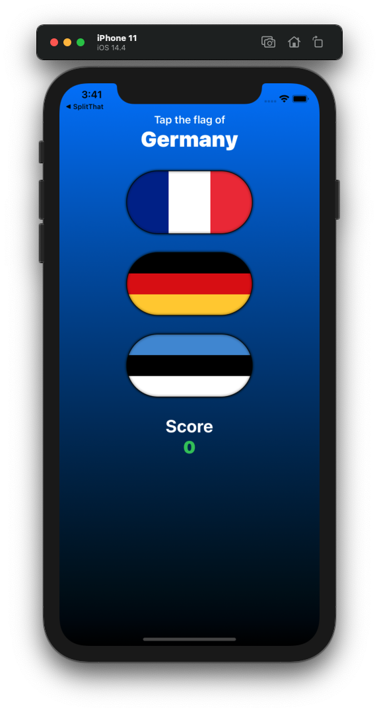
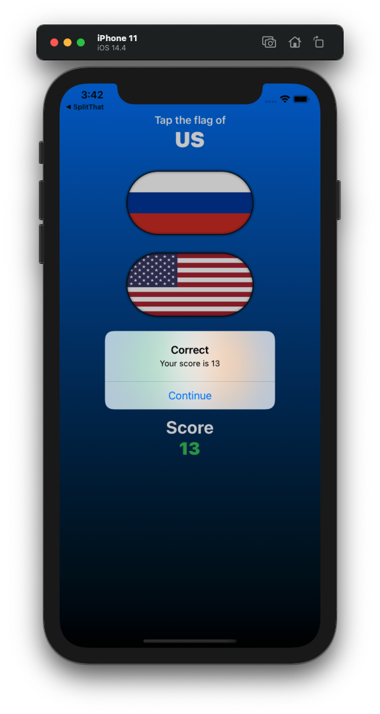

# Project 02 - GuessTheFlag

Project #2 of "100 days of SwiftUI" course. 
Day 20: https://www.hackingwithswift.com/100/swiftui/20

## Solution to challenges

>1. Add an @State property to store the user’s score, modify it when they get an answer right or wrong, then display it in the alert.

In the code you can see I added the new @State variable, and modified it in the flagTapped function, in the way, if user answer is correct we add 1 point to score, if user answer is wrong we rest 1 to the score, but always checking that the score is not 0, we don’t want to display a minus score.

>2. Show the player’s current score in a label directly below the flags.

Next to the ForEach we added the last VStack to make 2 Texts, one for placing “Score” and the other one to display the score of the user.

>3. When someone chooses the wrong flag, tell them their mistake in your alert message – something like “Wrong! That’s the flag of France,” for example.

Chagend the message when the user choose a wrong answer, now the Alert displays the name of the wrong flag.

## Screenshoots

 
