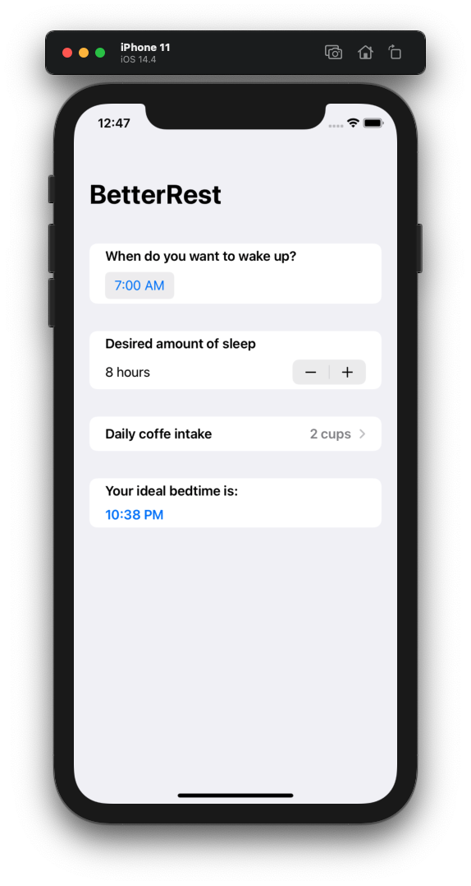

# Project 04 - BetterRest

Project #4 of "100 days of SwiftUI" course. 
Day 28: https://www.hackingwithswift.com/100/swiftui/28

## Solution to challenges

>1. Replace each VStack in our form with a Section, where the text view is the title of the section. Do you prefer this layout or the VStack layout? It’s your app – you choose!

Added section but didn't remove VStack to create the view without the line of the form.

>2. Replace the “Number of cups” stepper with a Picker showing the same range of values.

Changed the stepper for a picker, but used the same IF, with a small modification to achieve better UI.

>3. Change the user interface so that it always shows their recommended bedtime using a nice and large font. You should be able to remove the “Calculate” button entirely.

Removed the calculate button, and modified the calculatedBedTime func to return a STRING to be able to use it in a Text component and show the result in the screen.

## Screenshoots

