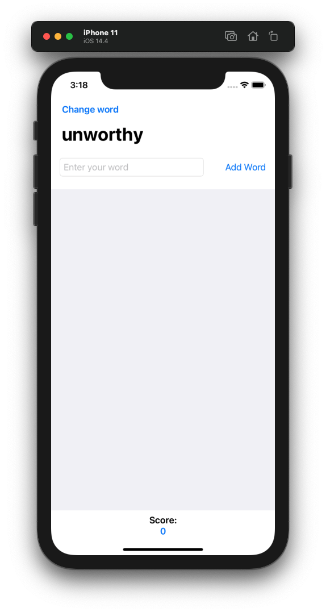
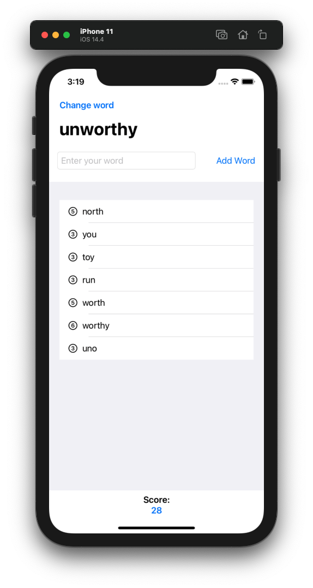

# Project 05 - WordScramble

Project #5 of "100 days of SwiftUI" course. 
Day 30: https://www.hackingwithswift.com/100/swiftui/30

## Solution to challenges

>1. Disallow answers that are shorter than three letters or are just our start word. For the three-letter check, the easiest thing to do is put a check into isReal() that returns false if the word length is under three letters. For the second part, just compare the start word against their input word and return false if they are the same.

For the second part, i added a new guard in the addNewWord func,  where i checked if the word was the same as rootWord. For the less tha three characters, i added a guard in the isReal func, yo check if the word has more than two letters.

>2. Add a left bar button item that calls startGame(), so users can restart with a new word whenever they want to.

Added a left bar button to change the word.

>3. Put a text view below the List so you can track and show the player’s score for a given root word. How you calculate score is down to you, but something involving number of words and their letter count would be reasonable.

Added a VStack and to Text, one for the title and another one for the score (the score variable is a @State variable to be able to change and change the UI when needed), the score value is changed every time user adds a new word to calculate the new score.

## Screenshoots

