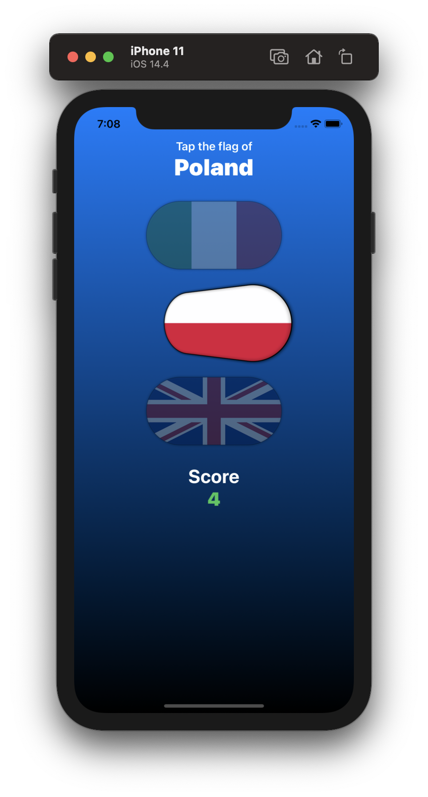
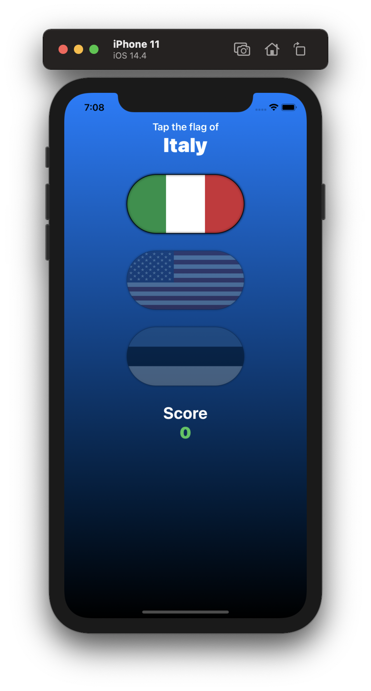

# Project 6 challenges: Challenges in Project Guess The Flag

Project #6 of "100 days of SwiftUI" course. 
Day 34: https://www.hackingwithswift.com/100/swiftui/34

## Solution to challenges

>1. When you tap the correct flag, make it spin around 360 degrees on the Y axis.

For this challenge, we added a 3DRotation effect to the buttons, using a array of "Floats spinYAnimationAmounts" to interact with the
actual button. When the user taps the correct flag, we execute the animation.

>2. Make the other two buttons fade out to 25% opacity.

This was far more easy, just created a bool variable for knowing when to show the opacity, and added the modifier to the buttons ".opacity", here we tell swift to only paint the view that is not the correct answer.

Also in adition to all this, i added a delay to the app, this is for letting the user time to see the animations.

>3. And if you tap on the wrong flag? Well, that’s down to you – get creative!

This time i was trying to do a shaking animation my self, but i ended using this struct from https://www.objc.io/blog/2019/10/01/swiftui-shake-animation/

In the same way we did it with the 360 rotation, i created a array of attemps for each button.

## Screenshoots

