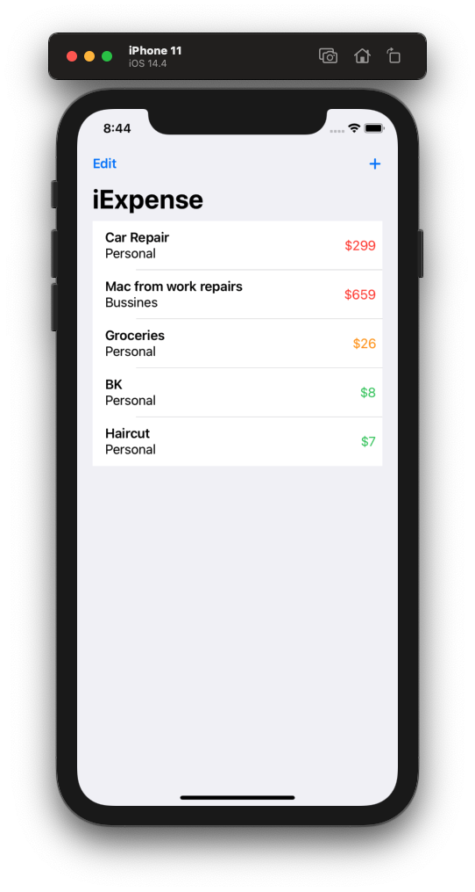
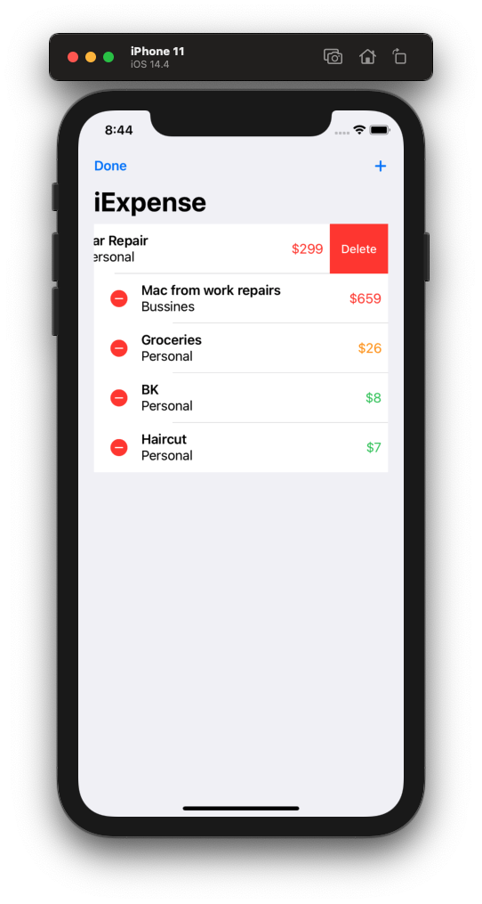
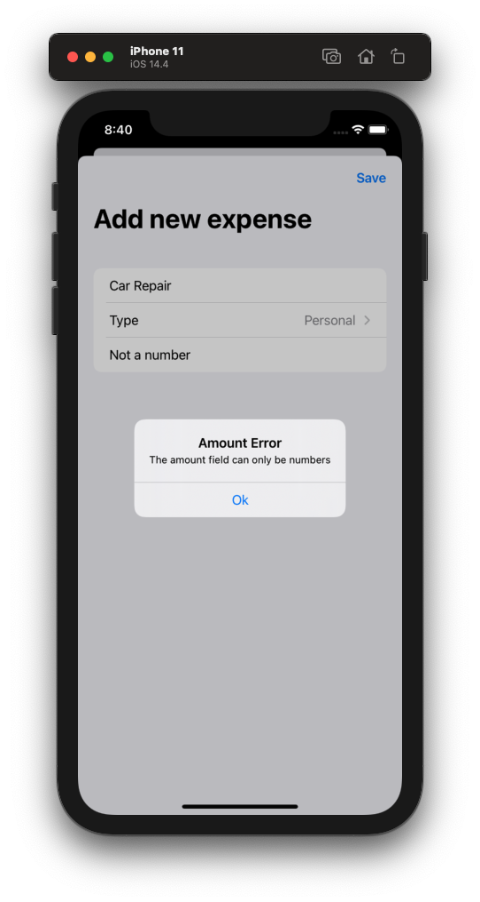

# Project 7 - iExpense

Project #7 of "100 days of SwiftUI" course. 
Day 38: https://www.hackingwithswift.com/100/swiftui/38

## Challenge

>1. Add an Edit/Done button to ContentView so users can delete rows more easily.

Added the leading EditButton() to the navigation bar items.

>2. Modify the expense amounts in ContentView to contain some styling depending on their value – expenses under $10 should have one style, expenses under $100 another, and expenses over $100 a third style. What those styles are depend on you.

Created a func that is called every time the view is going to set the foreground color of the amount, returning green, orange or red respect of the range of the amount.

>3.  Add some validation to the Save button in AddView. If you enter “fish” or another thing that can’t be converted to an integer, show an alert telling users what the problem is.

Added an alert to the Sheet, when the validations of a number dont pass, the code turns the amountError to true and triggers the Alert.

## Screenshoots

