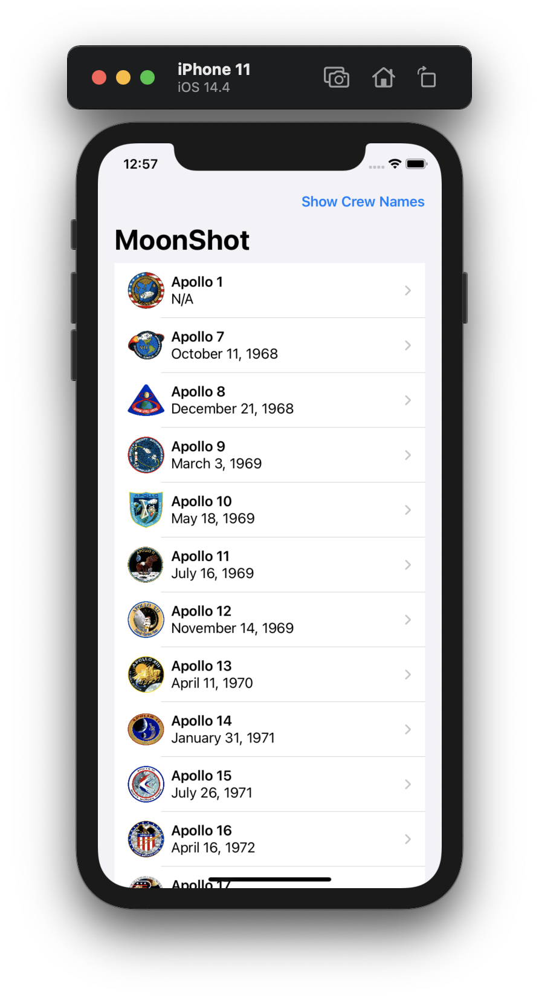
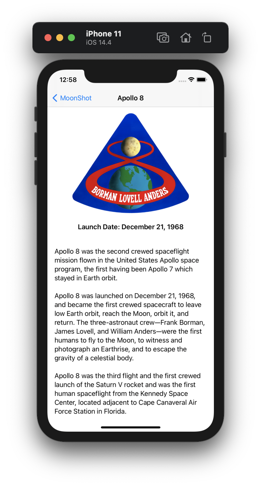

# Project 8 - MoonShot

Project #8 of "100 days of SwiftUI" course. 
Day 42: https://www.hackingwithswift.com/100/swiftui/42

## Challenge

>1. Add the launch date to MissionView, below the mission badge.

Added another Text to the VStack and called the var .formattedLaunchDate

>2. Modify AstronautView to show all the missions this astronaut flew on.

To retrieve the missions where an astronaut has been, we need to first get the complete Missions array, then we make a for loop and check if the current astronaut appears in anyone, if so, we add that mission to screen.

In the ForEach loop of MissionsIns, i created a simple view, where not only the name of the mission is displayed, also the image of the Mission.

>3. Make a bar button in ContentView that toggles between showing launch dates and showing crew names.

The tricky challenge, but very easy, simple button in the navigation, 2 State vars, one for the toogle of bool and the other one to change the button name. Get the Full name of the crewMember with a new func, and with the toogle we can set an IF that shows or hide the launch date, and make the names appear or disappear.

## Screenshoots

