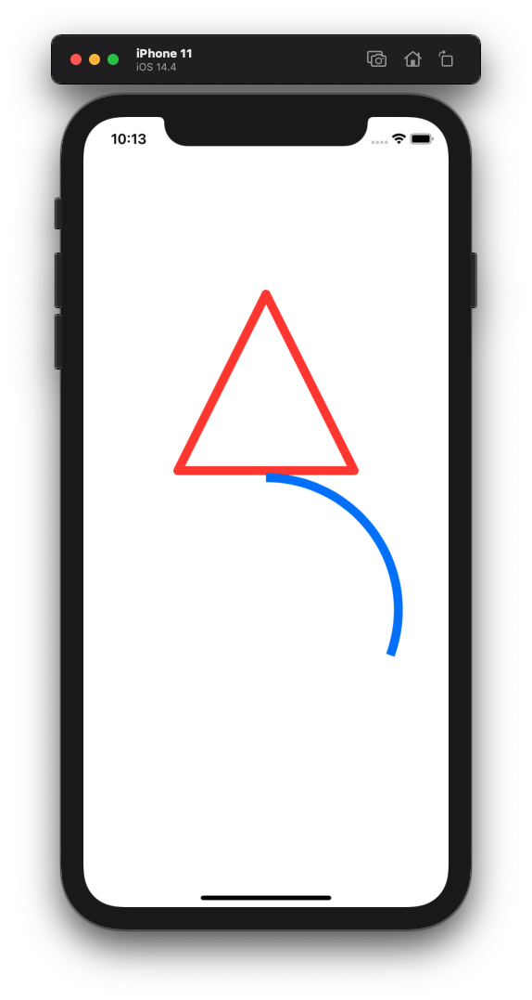
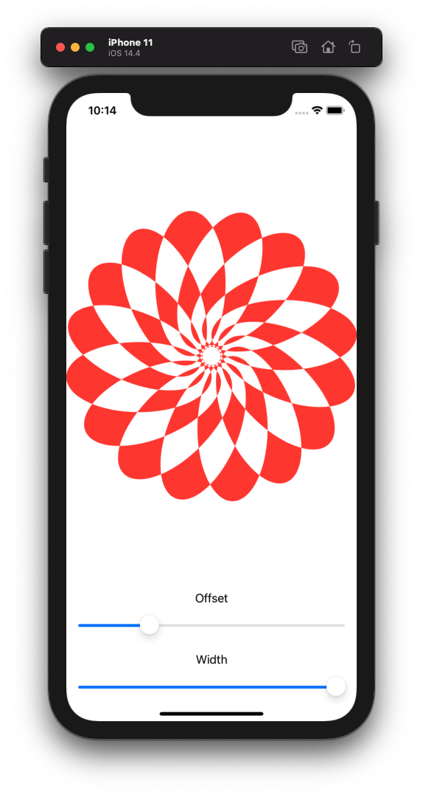
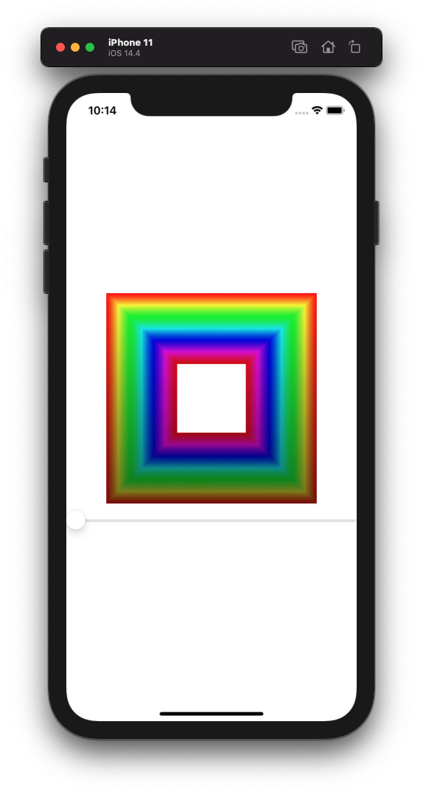
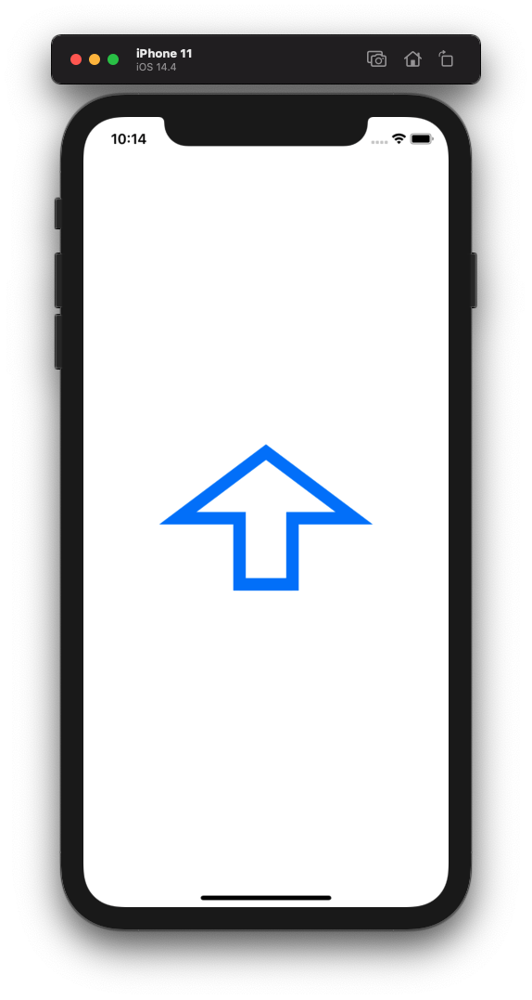

# Project 9 - Drawing

Project #9 of "100 days of SwiftUI" course. 
Day 46: https://www.hackingwithswift.com/100/swiftui/46

## Challenge

>1. Create an Arrow shape made from a rectangle and a triangle – having it point straight up is fine.

A difficult one, searched a lot and is not of my best challenges, i can say i dont like pretty much making shapes. Just searched a lot to find a suitable and easy solution to make the paths combined with rectangles and triangle make an arrow.

>2. Make the line thickness of your Arrow shape animatable.

Here i added a tap gesture to the arrow and changed the lineWidth to a random float from 1 to 15, all this change inside of a animation block.

>3. Create a ColorCyclingRectangle shape that is the rectangular cousin of ColorCyclingCircle, allowing us to control the position of the gradient using a property.

Used the same example of Paul Hudson ColorCyclingCircle but changed the shape to a Rectangle.

## Screenshoots

