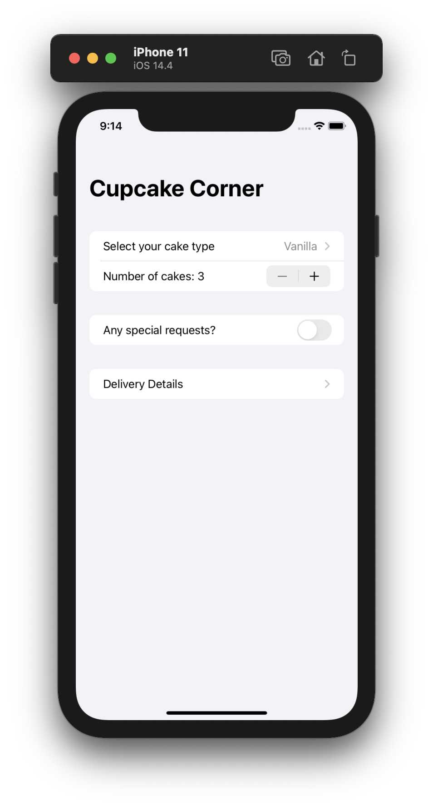
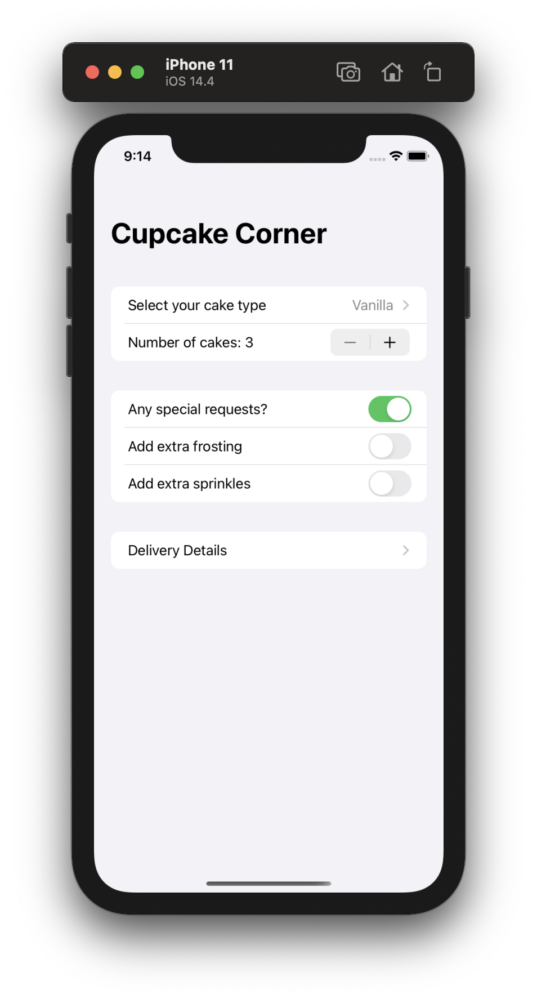
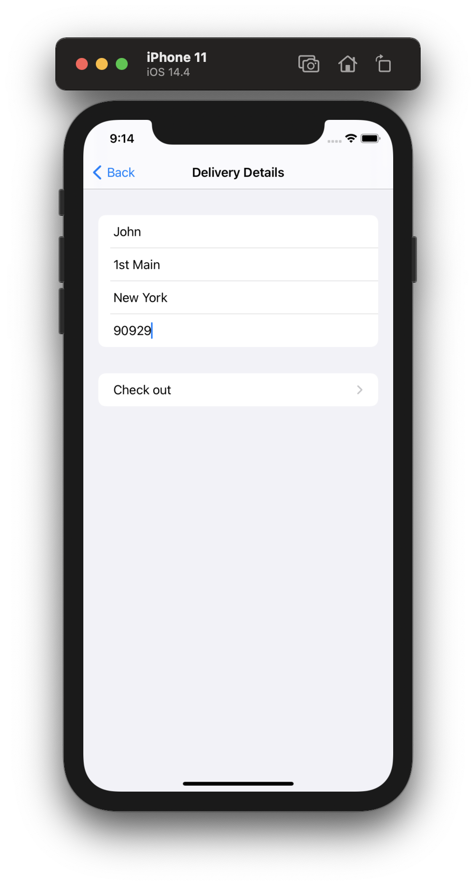
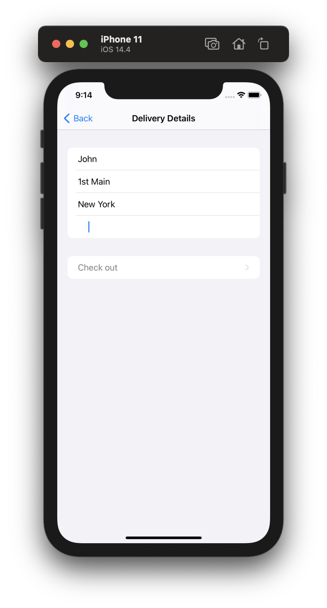
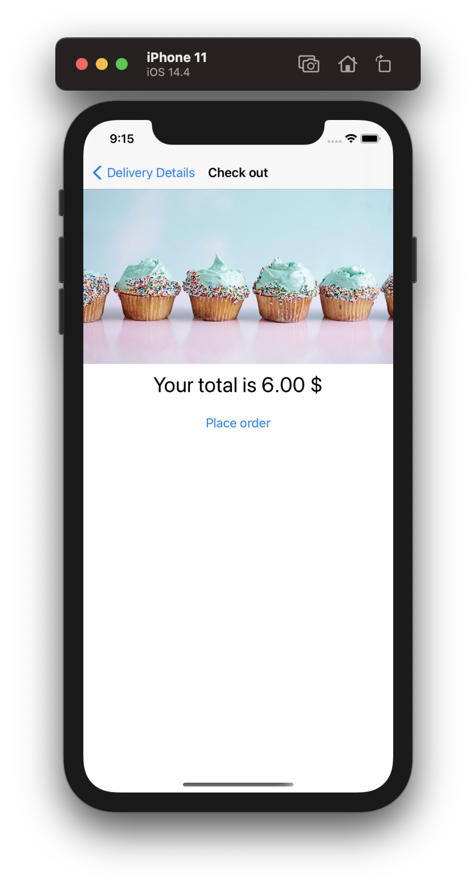
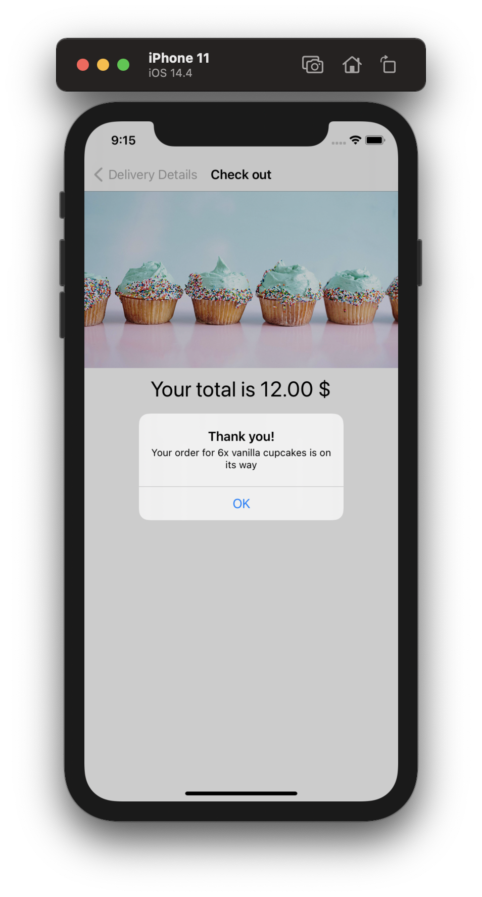

# Project 10 - Cupcake Corner

Project #10 of "100 days of SwiftUI" course. 
Day 52: https://www.hackingwithswift.com/100/swiftui/52

## Challenge

>1. Our address fields are currently considered valid if they contain anything, even if it’s just only whitespace. Improve the validation to make sure a string of pure whitespace is invalid.

For this challenge i created an extension of String, to check for the empty spaces in all the String, so to check the fields i added the empty space string validation to the hasValidAddress bool.

>2. If our call to placeOrder() fails – for example if there is no internet connection – show an informative alert for the user. To test this, just disable WiFi on your Mac so the simulator has no connection either.

This challenge was a little bit rare, i didnt do the internet check, but i certainly transform the old prints errors to alerts, this way the user can know whats happening with the request.

>3. For a more challenging task, see if you can convert our data model from a class to a struct, then create an ObservableObject class wrapper around it that gets passed around. This will result in your class having one @Published property, which is the data struct inside it, and should make supporting Codable on the struct much easier.

It took me quite a time to understand how to do it, i searched a lot for knowing how to transform the class to a struct mantaining all data, but at the end the answer its the question, literally create a new class that will hold the struct, this class now have the ObservableObject with the struct inside of it with the @Published annotation.

## Screenshoots

