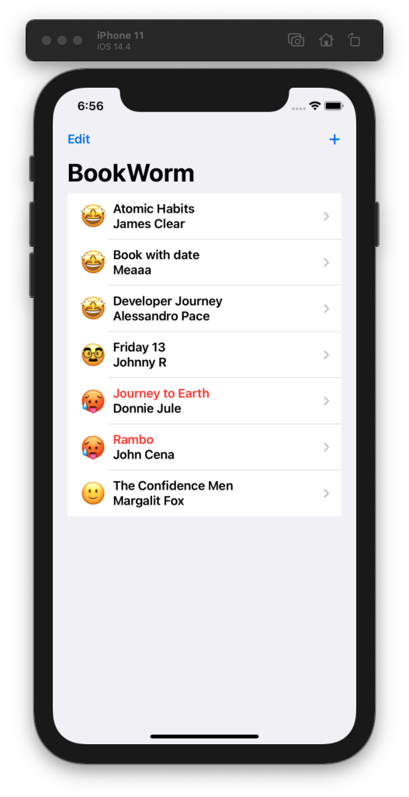
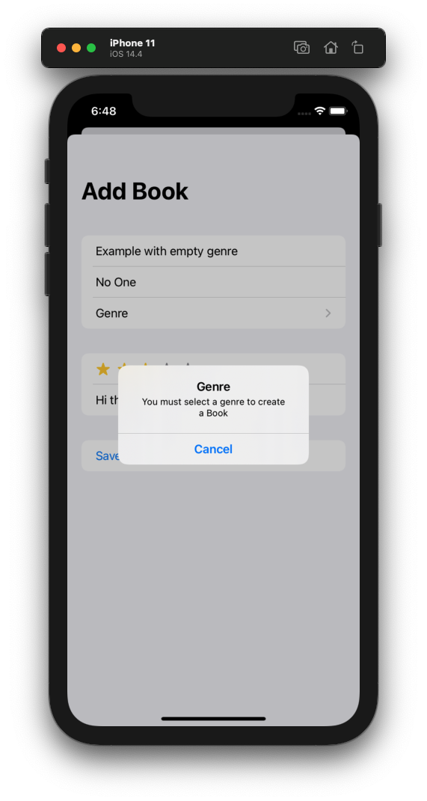

# Project 11 - BookWorm

Project #11 of "100 days of SwiftUI" course. 
Day 56: https://www.hackingwithswift.com/100/swiftui/56

## Challenge

>1. Right now it’s possible to select no genre for books, which causes a problem for the detail view. Please fix this, either by forcing a default, validating the form, or showing a default picture for unknown genres – you can choose.

For this challenge i created a Alert in the DetailView, and also created a func to see if the genre string is empty or not, if its empty show an alert, and if is filled, create the book normally.

>2. Modify ContentView so that books rated as 1 star have their name shown in red.

In the Text of book title, i added a foregroundColor modifier, so when the book rating is 1, the text color is red, otherwise is black.

>3. Add a new “date” attribute to the Book entity, assigning Date() to it so it gets the current date and time, then format that nicely somewhere in DetailView.

Added date (Date) attribute to the Book entity, and when a new book is created we set the date value to Date() to get the time and hour of creation. Then in detail view the creation date is formatted and visible.

## Screenshoots

