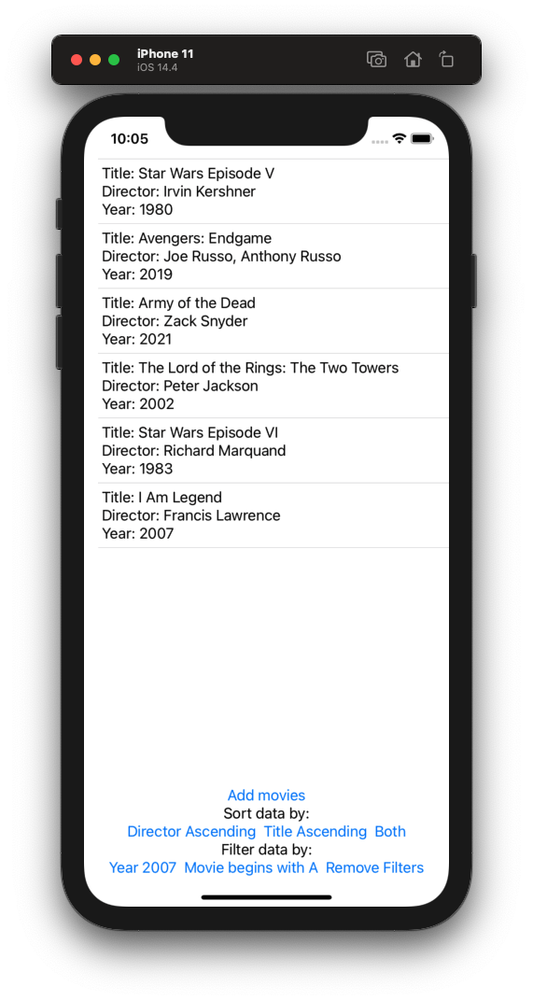
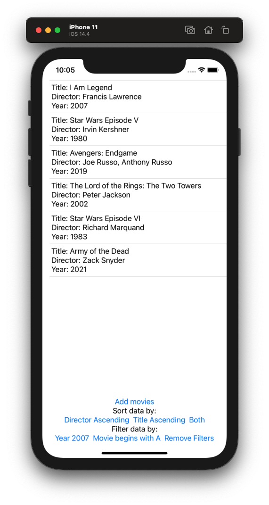
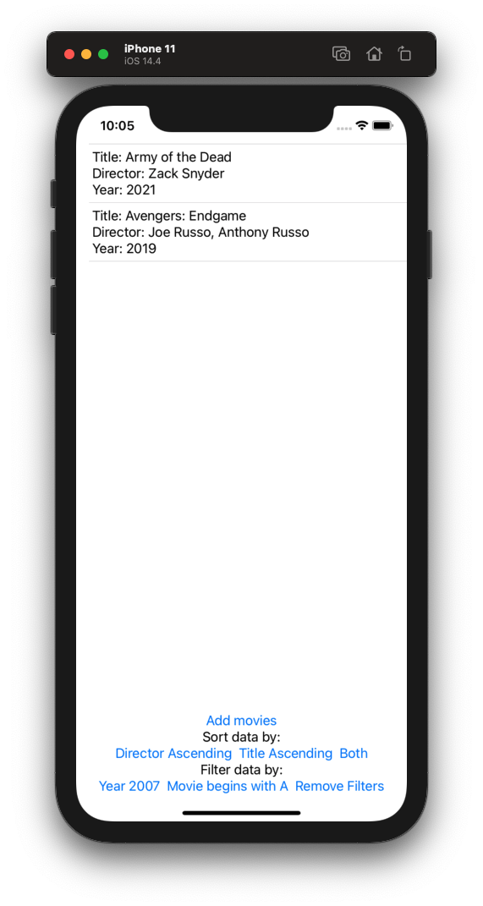

# Project 12 - CoreData

Project #12 of "100 days of SwiftUI" course. 
Day 59: https://www.hackingwithswift.com/100/swiftui/59

## Challenge

>1. Make it accept an array of NSSortDescriptor objects to get used in its fetch request.

For this challenge, just added an array of NSSortDescriptor to the FilteredList init, and replaced the [] from the FetchRequest with the array from init.

>2. Make it accept a string parameter that controls which predicate is applied. You can use Swift’s string interpolation to place this in the predicate.

Added a predicate String to the init, to allow the user specify which predicate want to use, in the FetchRequest, we changed the static value of the predicate to a String interpolated var.

>3. Modify the predicate string parameter to be an enum such as .beginsWith, then make that enum get resolved to a string inside the initializer.

In the filteredList view added a enum of strings of each case that can be used as a predicate, changed the init from predicante String to the Predicates enum.

## Screenshoots

