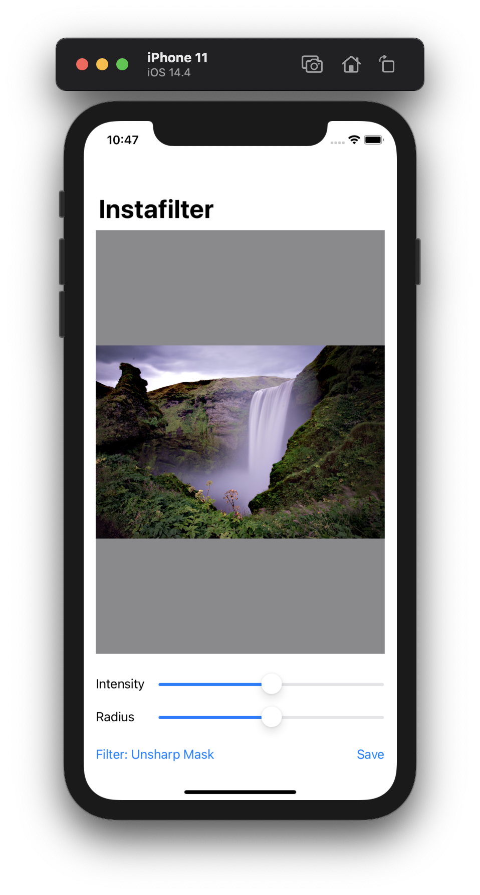
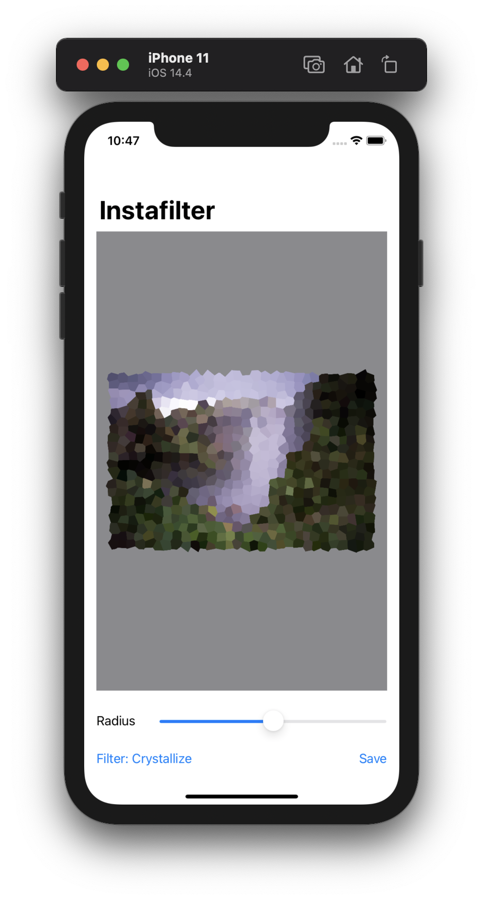
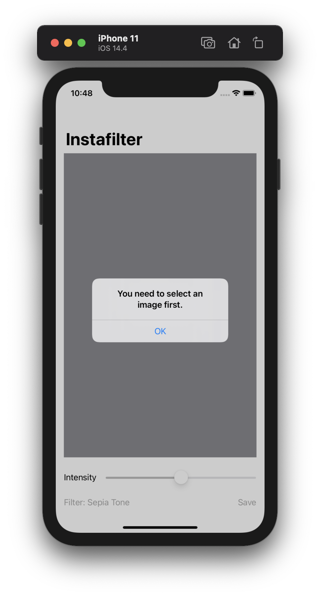
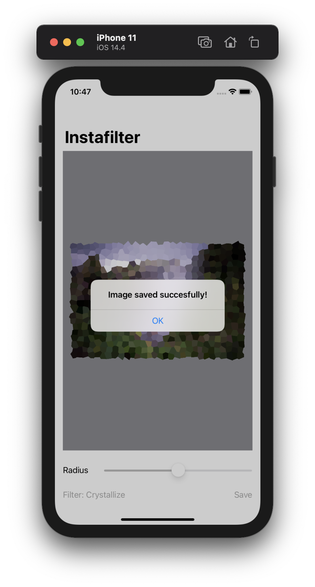

# Project 13 - Instafilter

Project #13 of "100 days of SwiftUI" course. 
Day 67: https://www.hackingwithswift.com/100/swiftui/67

## Challenge

>1. Try making the Save button show an error if there was no image in the image view.

Added a new alert when user tap save and have not selected an image.

>2. Make the Change Filter button change its title to show the name of the currently selected filter.

Added a new @State var to get the current filter name, and changed the name of the button at the same time the user selects a new filter.

>3. Experiment with having more than one slider, to control each of the input keys you care about. For example, you might have one for radius and one for intensity.

2 new properties added, filterRadius and filterScale, added new sliders and updated the view to only show the sliders if the current filter accepts the modifier, then in the processing of the image we use the var radius, scale or intensity when needed.

## Screenshoots

