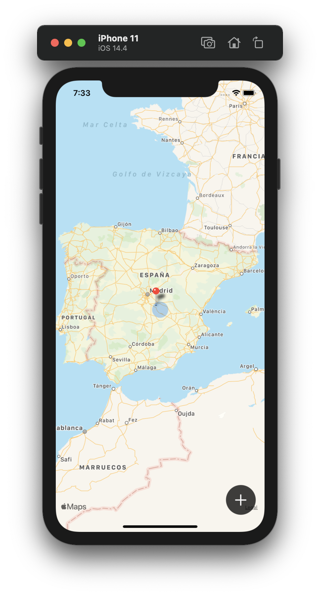
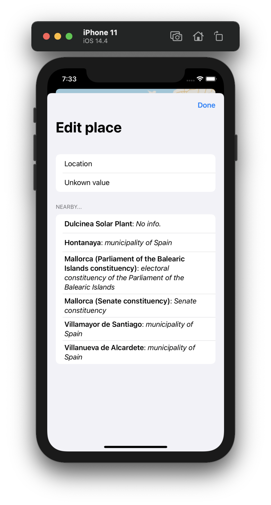
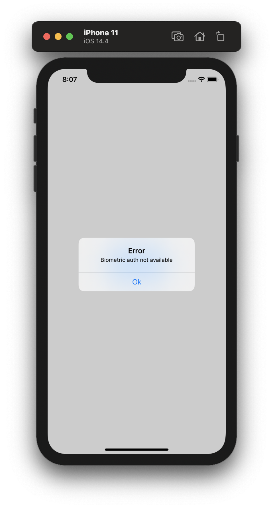

# Project 14 - BucketList

Project #14 of "100 days of SwiftUI" course. 
Day 73: https://www.hackingwithswift.com/100/swiftui/73

## Challenge

>1. Our + button is rather hard to tap. Try moving all its modifiers to the image inside the button – what difference does it make, and can you think why?

Modifiers moved to the image instead of the button.

>2. Having a complex if condition in the middle of ContentView isn’t easy to read – can you rewrite it so that the MapView, Circle, and Button are part of their own view? This might take more work than you think!

Moved all the Map logic to a new view, so the main view is clean.

>3. Our app silently fails when errors occur during biometric authentication. Add code to show those errors in an alert, but be careful: you can only add one alert() modifier to each view.

Added vars and alert to the content view, so when the biometric auth its not available or have an error, the app will display an alert to the user.

## Screenshoots

