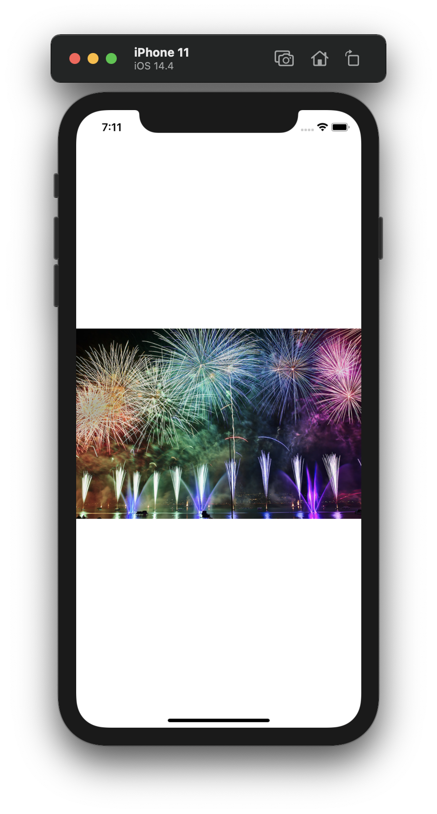

# Project 15 - Accessibility

Project #15 of "100 days of SwiftUI" course. 
Day 76: https://www.hackingwithswift.com/100/swiftui/76

## Challenge

>1. The check out view in Cupcake Corner uses an image that doesn’t add anything to the UI, so find a way to make the screenreader not read it out.

In [Project 10](10-CupcakeCorner) - *CupcakeCorner* in the CheckOutView, added the .accessibility(hidden: true) modifier to prevent the voice over from reading it.

>2. Fix the steppers in BetterRest so that they read out useful information when the user adjusts their values.

In [Project 4](04-BetterRest) - *BetterRest*, in Project.swift, added the .accessibility value in 2 points, one in the first stepper and in the picker, to announce the user the hours or the cups of coffee

>3. Do a full accessibility review of Moonshot – what changes do you need to make so that it’s fully accessible?

In [Project 8](08-MoonShot) - *MoonShot*  there is accessibility modifier for almost every view.

## Screenshoots

