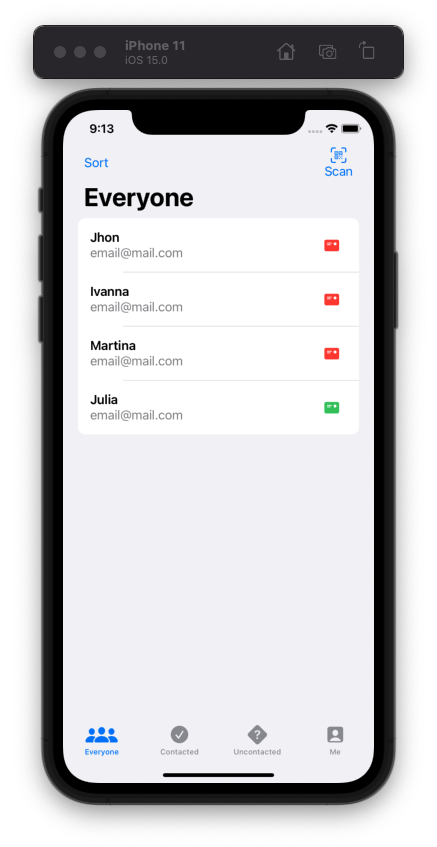
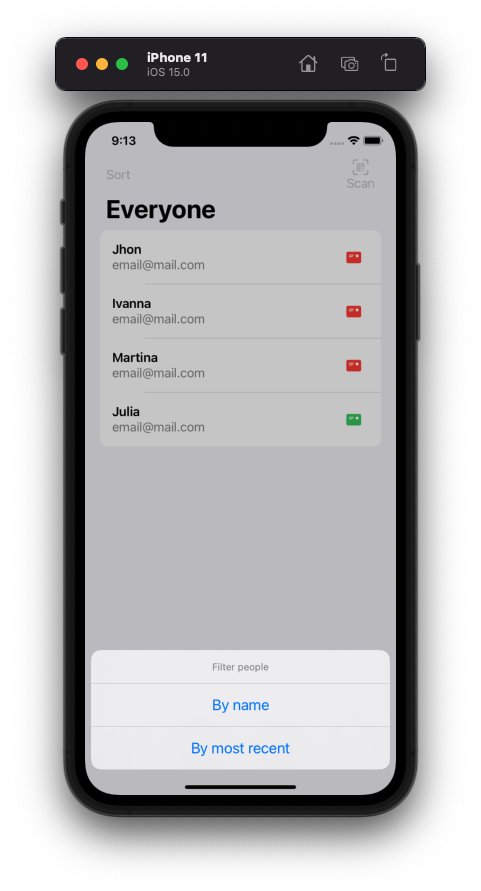
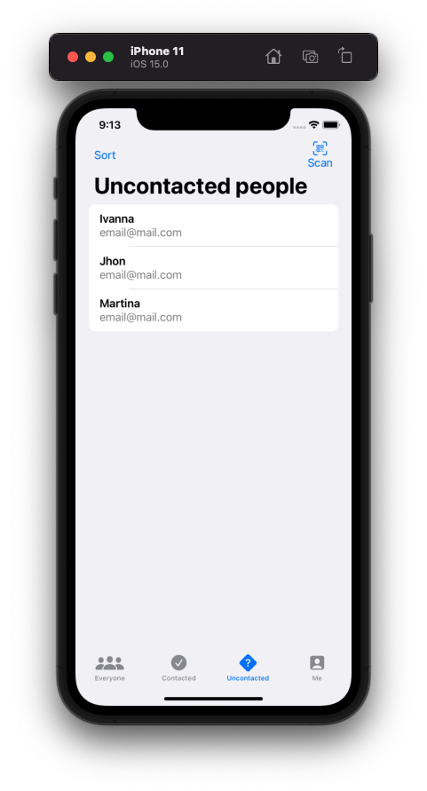
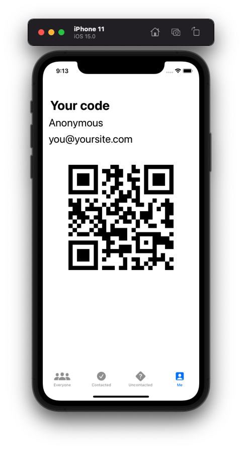

# Project 16 - Hot Prospects

Project #16 of "100 days of SwiftUI" course. 
Day 85: https://www.hackingwithswift.com/100/swiftui/85

## Challenge

>1. Add an icon to the “Everyone” screen showing whether a prospect was contacted or not.

Added filterType variable to the ProspectView (i separated the logic for the cell), then used that filter to know if the screen is "Everyone" to show the image is the person was contacted or not.

>2. Use JSON and the documents directory for saving and loading our user data.

Used the same FileManager class from old projects and changed all the logic from UserDefaults to FileManger.

>3. Use an action sheet to customize the way users are sorted in each screen – by name or by most recent.

Added button in navigation bar to deploy the action sheet, added comparable to prospect. When the users select a sort, whe take the array and sort by the choosen sort.

## Screenshoots

