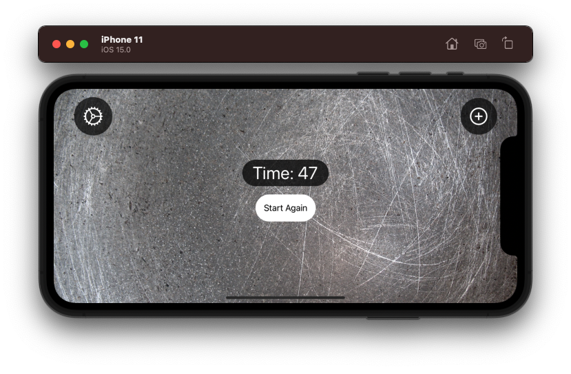
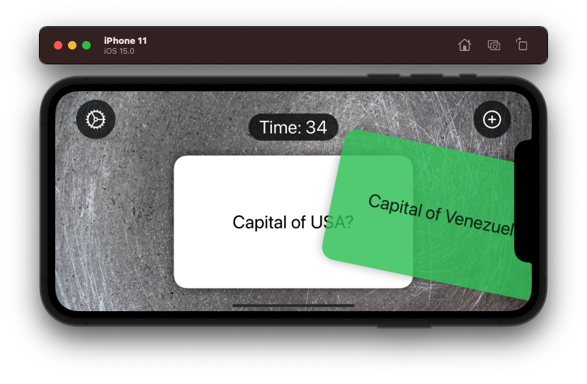
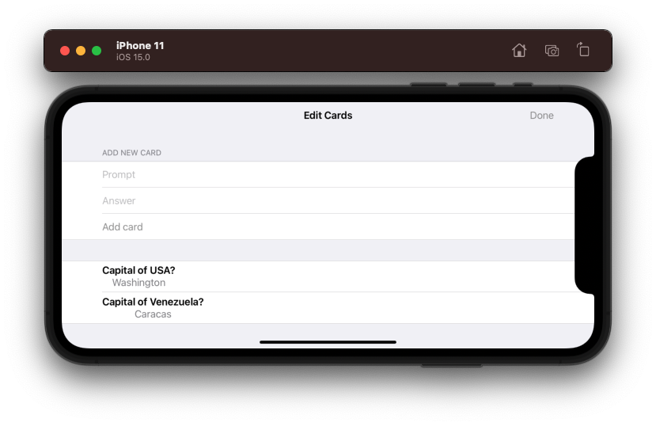
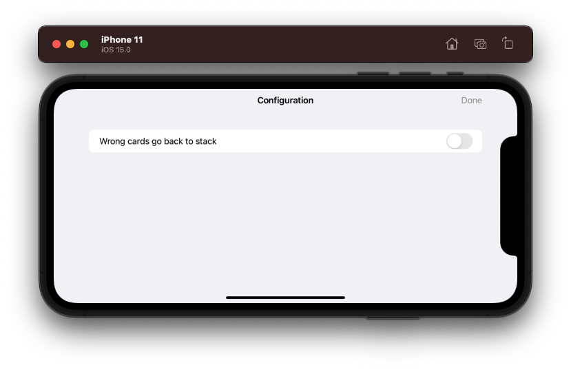
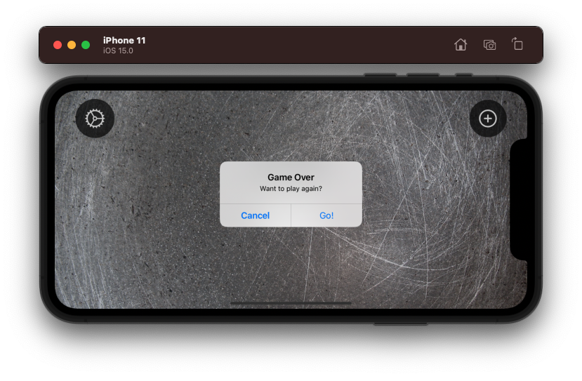

# Project 17 - FlashZilla

Project #17 of "100 days of SwiftUI" course. 
Day 91: https://www.hackingwithswift.com/100/swiftui/91

## Challenge

>1. Make something interesting for when the timer runs out. At the very least make some text appear, but you should also try designing a custom haptic using Core Haptics.

Added alert and haptics when the timer reachs 0, also modified a few things to make all work together.

>2. Add a settings screen that has a single option: when you get an answer one wrong that card goes back into the array so the user can try it again.

Added new logic to let 2 sheets in same screen. Added functionality in both CardView and MainView to know when the card is incorrect and stack or not the wrong card.

>3. If you drag a card to the right but not far enough to remove it, then release, you see it turn red as it slides back to the center. Why does this happen and how can you fix it? (Tip: use a custom modifier for this to avoid cluttering your body property.)

Created a func to retrieve with the offset the correct color, not only setting one if, but two, to know when each case is happeningn and be able to color green or red when its needed.

## Screenshoots

