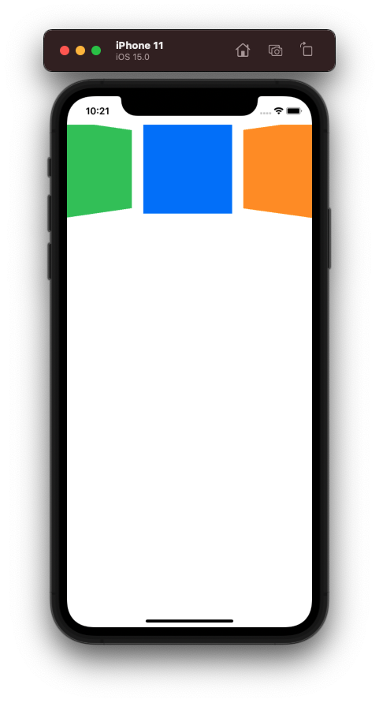

# Project 18 - Layout and geometry

Project #18 of "100 days of SwiftUI" course. 
Day 94: https://www.hackingwithswift.com/100/swiftui/94

## Challenge

>1. Change project 8 (Moonshot) so that when you scroll down in MissionView the mission badge image gets smaller. It doesn’t need to shrink away to nothing – going down to maybe 80% is fine.

In [Project 8](8-Moonshot) - *Moonshot* in MissionView, added a new geometry reader, to calculate with a func the scale and offset of the image to achieve the transformation when scrolling.

>2. Change project 5 (Word Scramble) so that words towards the bottom of the list slide in from the right as you scroll. Ideally at least the top 8-10 words should all be positioned normally, but after that they should be offset increasingly to the right.

Unable to get this alone, searched for help, found the best working solution in this github from Guillaume A. https://github.com/clarknt/100-days-of-swiftui/blob/main/24-Project18/Challenge2/Project18-Challenge2/ContentView.swift

Updated [Project 5](05-WordScramble) - *WordScramble*

>3. For a real challenge make the letter count images in project 5 change color as you scroll. For the best effect, you should create colors using the Color(red:green:blue:) initializer, feeding in values for whichever of red, green, and blue you want to modify. The values to input can be figured out using the row’s current position divided by maximum position, which should give you values in the range 0 to 1.

Got a litle solution, not the final, same ContentView in [Project 5](05-WordScramble) - *WordScramble* added a foreground modifier that change the color of the text changing the red taking the item geometry and list geometry.

## Screenshoots

