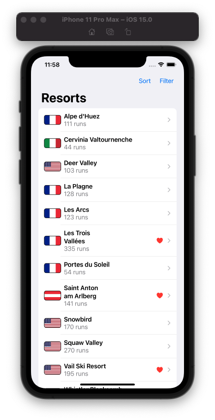
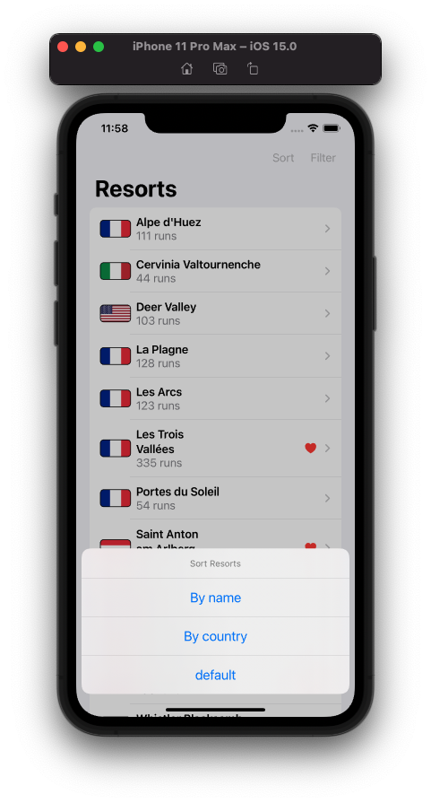
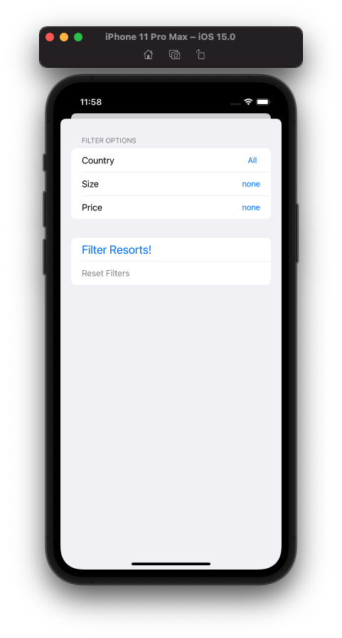
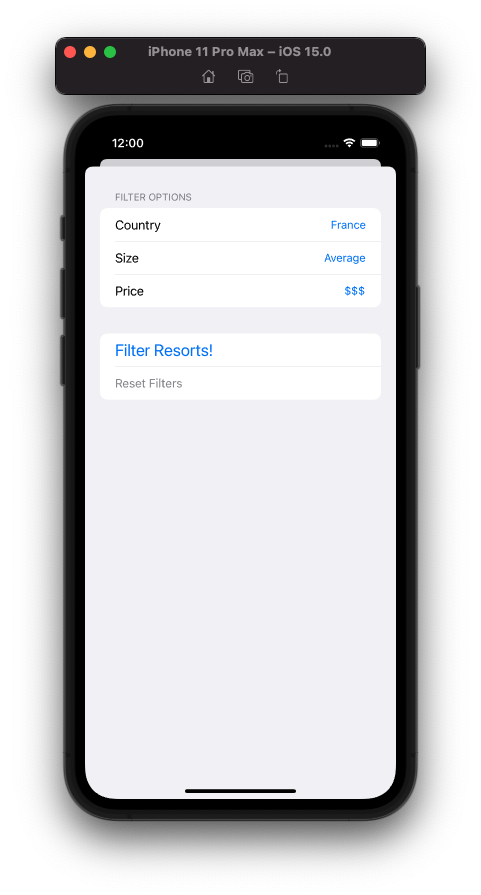
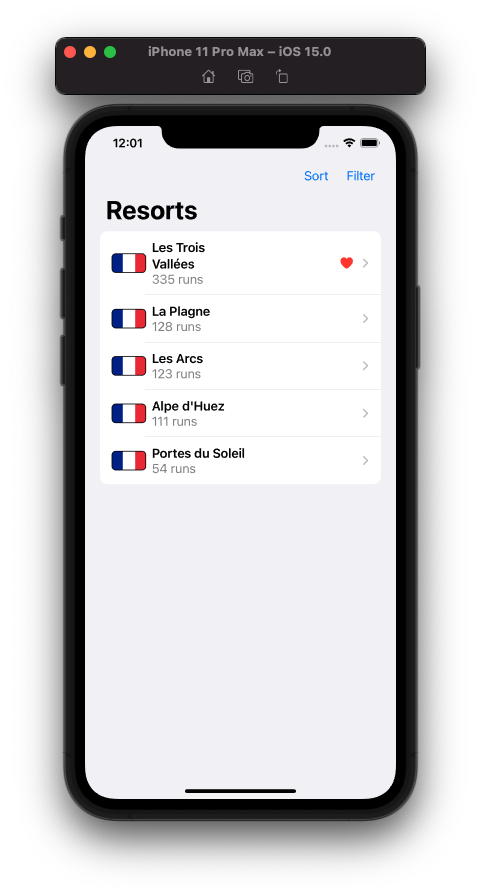
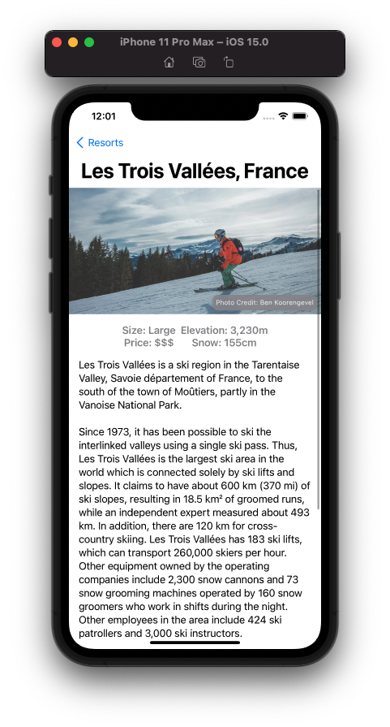

# Project 19 - SnowSeeker

Project #19 of "100 days of SwiftUI" course. 
Day 99: https://www.hackingwithswift.com/100/swiftui/99

## Challenge

> 1. Add a photo credit over the ResortView image. The data is already loaded from the JSON for this purpose, so you just need to make it look good in the UI.

Created a new SwiftUI view, called CreditOverlay, and used the modifier overlay in the image of the resort to add the text of image credit.

> 2. Fill in the loading and saving methods for Favorites.

Added the same file created a few projects ago to save data in the user documents, modified Favorites to decode data and encode data.

> 3. For a real challenge, let the user sort and filter the resorts in ContentView. For sorting use default, alphabetical, and country, and for filtering let them select country, size, or price.

Added a new view "FilterSheet" (called from a navigation bar button) allowing the user to select country, size and price to filter the list of resorts, for the sorting, added another navigation bar button, this time triggering a alert sheet where the user can select the option to sort.

## Screenshoots

