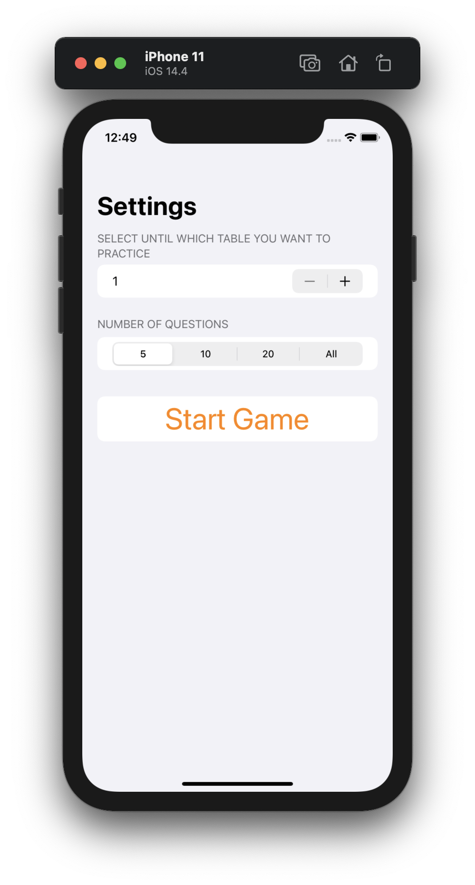
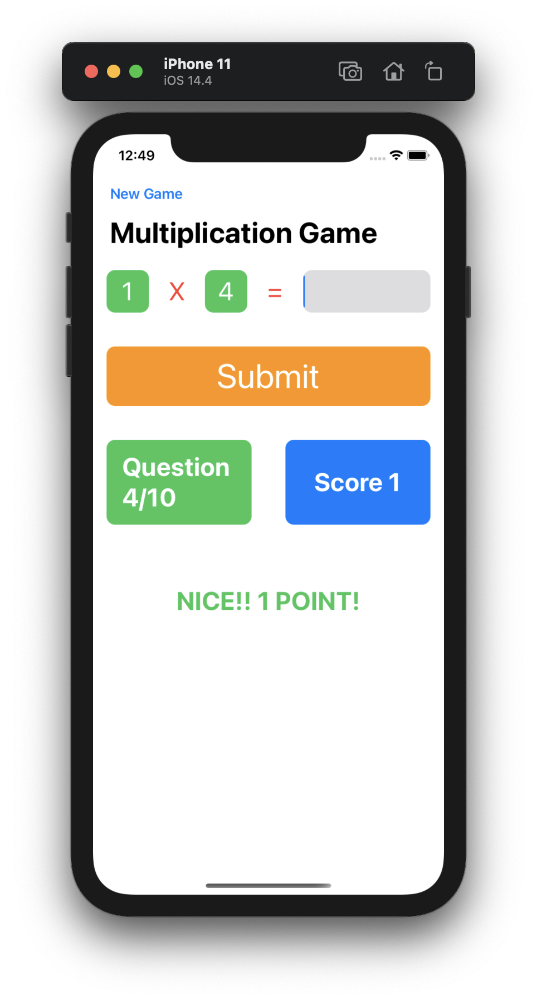
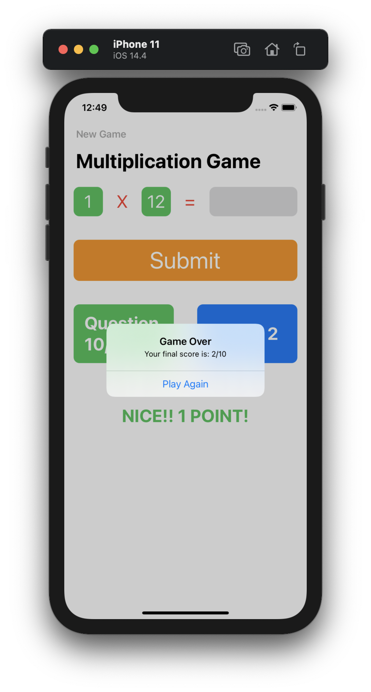

# Milestone Project 4-6
## Multiplication Tables

Milestone Project 4-6 of "100 days of SwiftUI" course. 
Day 35: https://www.hackingwithswift.com/100/swiftui/35

The only thing its not present in this challenge, its the animation part.

## Challenge

>Your goal is to build an “edutainment” app for kids to help them practice multiplication tables – “what is 7 x 8?” and so on. Edutainment apps are educational at their code, but ideally have enough playfulness about them to make kids want to play.

>Breaking it down:

>- The player needs to select which multiplication tables they want to practice. This could be pressing buttons, or it could be an “Up to…” stepper, going from 1 to 12.

>- The player should be able to select how many questions they want to be asked: 5, 10, 20, or “All”.

>- You should randomly generate as many questions as they asked for, within the difficulty range they asked for. For the “all” case you should generate all possible combinations.

## Screenshoots

