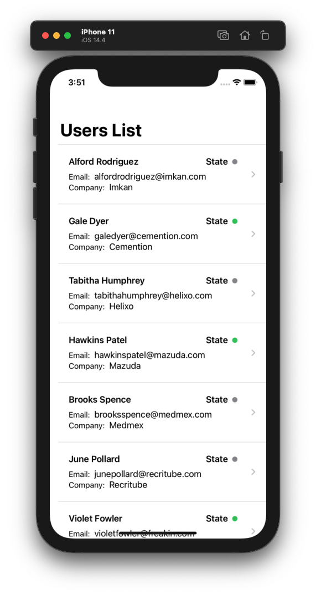
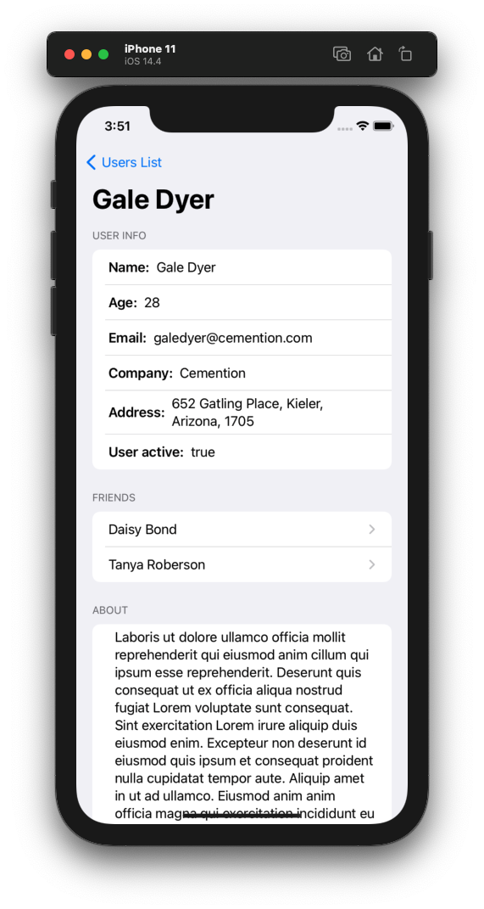
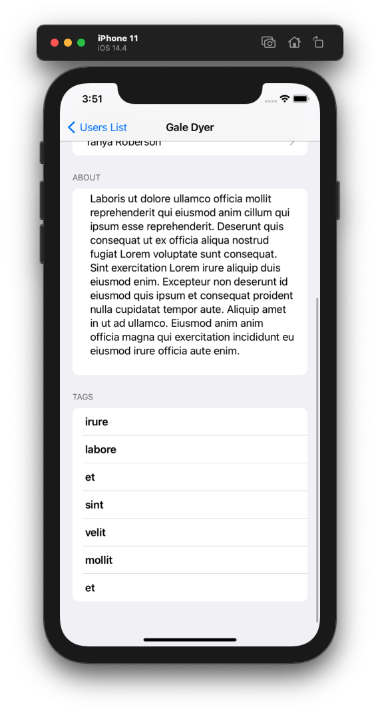

# Milestone Project 10-12
## Users List App

Milestone Project 10-12 of "100 days of SwiftUI" course. 
Day 60: https://www.hackingwithswift.com/100/swiftui/60
and Day 61: https://www.hackingwithswift.com/100/swiftui/61

This Project divides in 2 parts, more than parts, differents ways to aproach the final outcome:

- Day 60: Fetch data online
- Day 61: Fetch data online and stored using core data

This project is updated in the Core Data version, so all the parts of the day 60 is either commented or deleted.

## Challenges

For day 60:

>It’s time for you to build an app from scratch, and it’s a particularly expansive challenge today: your job is to use URLSession to download some JSON from the internet, use Codable to convert it to Swift types, then use NavigationView, List, and more to display it to the user.
>
>Your first step should be to examine the JSON. The URL you want to use is this: https://www.hackingwithswift.com/samples/friendface.json – that’s a massive collection of randomly generated data for example users.
>
>As you can see, there is an array of people, and each person has an ID, name, age, email address, and more. They also have an array of tag strings, and an array of friends, where each friend has a name and ID.
>
>How far you implement this is down to you, but at the very least you should:
>
>Fetch the data and parse it into User and Friend structs.
Display a list of users with a little information about them.
Create a detail view shown when a user is tapped, presenting more information about them.

For day 61:

> You need to use Core Data to store the information you download, then use your Core Data entities to display the views you designed – you should only need to fetch the data once.

## Screenshoots

