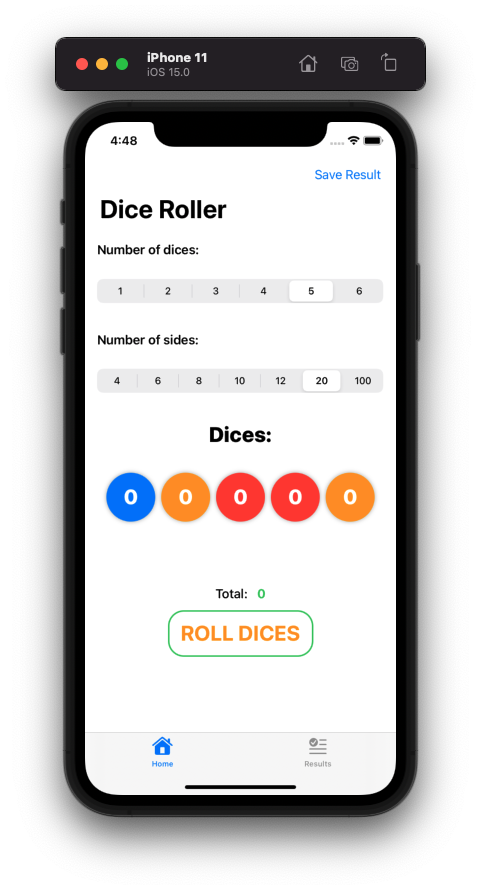

# Milestone Project 16-18
## DiceRoller App

Milestone Project 16-18 of "100 days of SwiftUI" course. 
Day 95: https://www.hackingwithswift.com/100/swiftui/95

## Challenges

>- Let the user customize the dice that are rolled: how many of them, and what type: 4-sided, 6-sided, 8-sided, 10-sided, 12-sided, 20-sided, and even 100-sided.
>- Show the total rolled on the dice.
>- Store the results using Core Data so they are persistent.
>- Add haptic feedback when dice are rolled.
>- For a real challenge, make the value rolled by the dice flick through various possible values before settling on the final figure.

## Screenshoots

